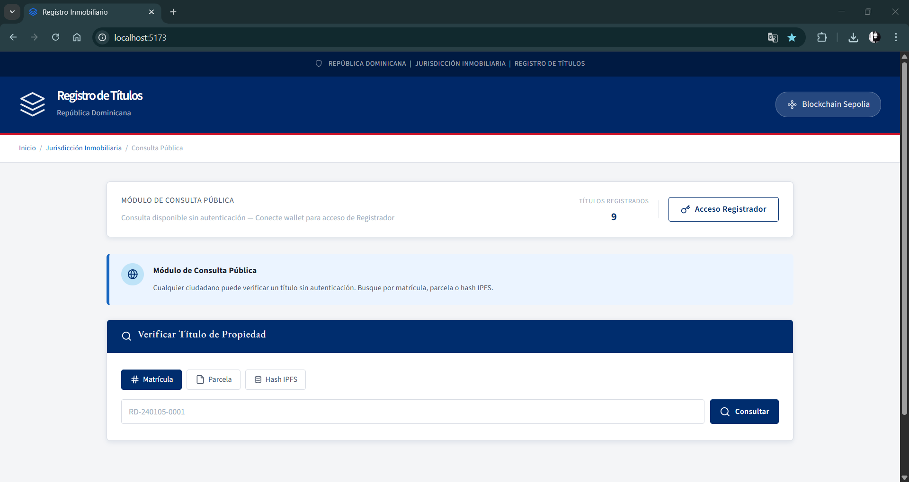
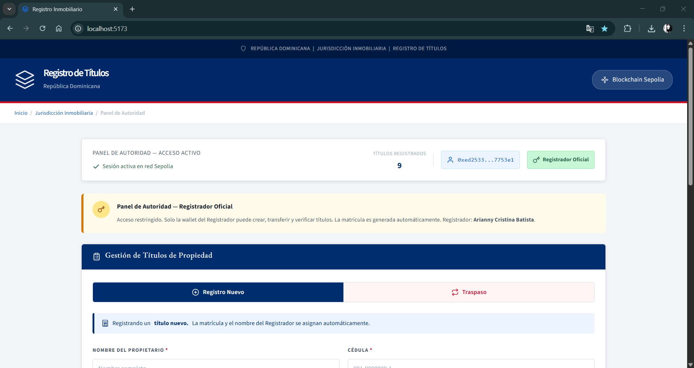
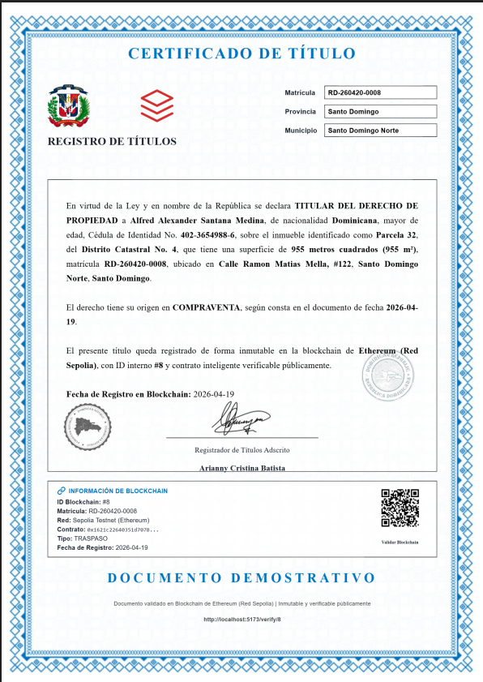

# Registro de Títulos Inmobiliarios con Blockchain

Proyecto de tesis para optar por el título de Ingeniería en Sistemas y Computacion
Universidad Dominicana O&M | Santo Domingo, RD

## Descripcion

Sistema descentralizado para el registro, verificacion y transferencia de titulos de propiedad inmobiliaria utilizando Blockchain (Ethereum), contratos inteligentes (Solidity) y almacenamiento descentralizado (IPFS).

El sistema garantiza:
- Inmutabilidad de los registros
- Trazabilidad completa del historial de propietarios
- Verificacion publica sin intermediarios
- Prevencion de duplicidad de titulos

## Arquitectura
Frontend (React.js) <--> MetaMask <--> Smart Contract (Ethereum Sepolia)
|
IPFS / Pinata (Documentos PDF)

text

## Tecnologias utilizadas

| Capa | Tecnologias |
|------|-------------|
| Frontend | React.js, Vite, Ethers.js, html2canvas, jsPDF, QRCode |
| Blockchain | Solidity, Ethereum Sepolia, MetaMask, Remix IDE |
| Almacenamiento | IPFS, Pinata |
| Lenguajes | JavaScript, Solidity, HTML5, CSS3 |

## Funcionalidades

- Registro de nuevos titulos con validacion de duplicidad (parcela + ubicacion)
- Consulta publica por ID, matricula, nombre, cedula o parcela
- Traspaso de titularidad con historial inmutable
- Verificacion oficial (solo Registrador autorizado)
- Generacion automatica de certificados PDF con codigo QR
- Almacenamiento descentralizado de documentos en IPFS

## Enlaces importantes

| Recurso | Enlace |
|---------|--------|
| Smart Contract (Sepolia) | 0xC5117F33935DcFEB2Ef59aa8743F12F5E3b8a8c9 |
| Ver en Etherscan | https://sepolia.etherscan.io/address/0xC5117F33935DcFEB2Ef59aa8743F12F5E3b8a8c9 |
| Aplicacion web | https://registro-titulos.vercel.app |
| Repositorio | https://github.com/AlfredSantana/registro-titulos |

## Estructura del Smart Contract

### Funciones principales

| Funcion | Acceso | Descripcion |
|---------|--------|-------------|
| registerProperty() | Solo Registrador | Registra nuevo titulo con validacion de duplicidad |
| transferProperty() | Solo Registrador | Transfiere titularidad y actualiza historial |
| verifyProperty() | Solo Registrador | Marca titulo como verificado oficialmente |
| getProperty() | Publico | Obtiene datos de un titulo por ID |
| getPropertiesByOwnerName() | Publico | Busca titulos por nombre del propietario |
| getPropertyByMatricula() | Publico | Busca por matricula (RD-YYMMDD-XXXXX) |

### Modificadores de seguridad
- onlyRegistrar(): Restringe operaciones de escritura a la wallet autorizada

## Pruebas realizadas

| Prueba | Resultado |
|--------|-----------|
| Registro de titulo con datos completos | Exitoso |
| Duplicidad (misma parcela + ubicacion) | Rechazado |
| Duplicidad (misma parcela, diferente ubicacion) | Permitido |
| Traspaso de titularidad | Exitoso |
| Verificacion oficial | Exitoso |
| Consulta publica por 5 criterios | Exitoso |
| Control de acceso (wallet no autorizada) | Rechazado |

## Instalacion local

## Capturas de pantalla

Pantalla principal:

Formulario de registro:

Certificado PDF generado:

# Clonar repositorio
git clone https://github.com/AlfredSantana/registro-titulos.git

# Instalar dependencias
npm install

# Variables de entorno (crear .env)
VITE_PINATA_JWT=tu_jwt_aqui
VITE_CONTRACT_ADDRESS=0xC5117F33935DcFEB2Ef59aa8743F12F5E3b8a8c9

# Ejecutar en desarrollo
npm run dev
Autor
Alfred Alexander Santana Medina
Estudiante de Ingenieria en Sistemas y Computacion
Universidad Dominicana O&M

Licencia
Proyecto academico. Todos los derechos reservados.
